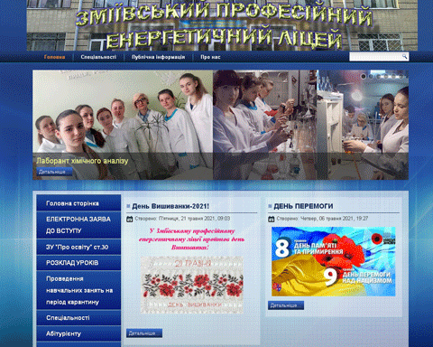
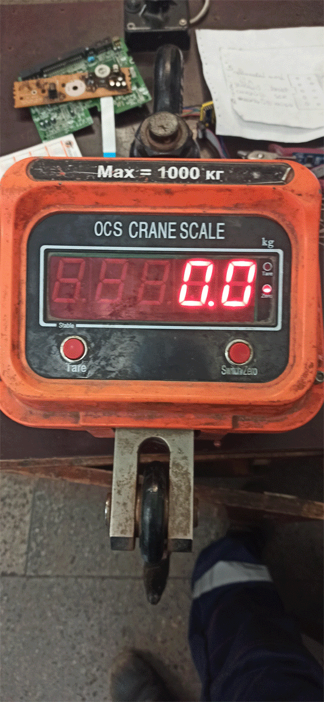
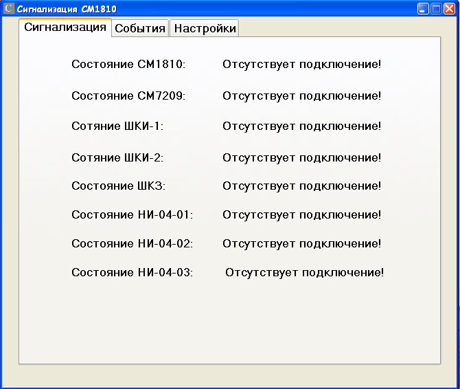

____
### Alexandr Burykin  
  
  

[LinkedIn](https://linkedin.com/in/alexandr-burykin-914b41215)  
[Telegram](https://t.me/BurykinAlexandr)  
[Viber](https://msng.link/o/?380931481434=vi)   
[Email](mailto:burykin.alexandr.work@gmail.com)  
[Skype](https://join.skype.com/invite/DDwbdilT21HX)  
Ukraine: +38066-535-44-68__

Date if birth: 07 of June 1990  
Education: Master degree / _Высшее_  
- [x] 2008 - 2013 - Master degree: Computer tehnologies in machine building / _Высшее: Компьютерные технологии в машиностроительном производстве_  
- [x] 2013 - 2015 - Teacher in Professional energy lyceum of Zmiiv / _Педагог в Змиевском професионально энергетическом лицее_  
- [x] 2018 - 2019 - Teacher in Professional energy lyceum of Zmiiv / _Педагог в Змиевском професионально энергетическом лицее_  
- [ ] 2019 - _now_ - Member of group information and measuring systems Zmiiv Power Station. / _Работник группы информационно-измерительных систем на Змиевской Тепловой Электроической Станции_  
____

### __Skills:__   
* English B2, Russian, Ukrainian  
* Touch typing: English, Russian, Ukrainian  
* Design Patterns  
* Git
* REST API
* Multithreading
* Algorithms  
* Android SDK  
* Kotlin(Coroutine, Coroutine Flow ...)  
* Firebase(Auth, Firestore, Storage...)  
* Android Jetpack(JUnit, Dagger Hilt, Compose ( + Compose Navigation), Live Data, Data Binding, Room, Work Manager, Retrofit ( +OkHTTP ), Paging, Shared Preferences ...)  
  

____
### My practice projects:
| __[Movie Info Searcher](https://github.com/oldr1990/Movies)__| __Kotlin__|
|:----|:---------------------:|
|  It has splashscreen(theme) and icon. In this app I used fragments for achive single activity app. Project was build with: __Tests, MVVM, Dagger Hilt,  Coroutines Flow, Retrofit, OkHTTP, Navigation, Paging, OMDb API__ . This app can search movis and series by name, year, type(all, movie, series).Every item of search painted in color based on the poster of it (background and text). You can get a more details by click specific item and check raiting and some specific details of that movie or series. _/ Это приложение может искать видео и сериалы по названию фильтруя по годам и/или типу (все, фильм, сериал). Каждый элемент поиска окрашен в цвет в зависимости от его плаката (фон и текст). Вы можете получить более подробную информацию, щелкнув конкретный элемент и посмотреть рейтинг и некоторые конкретные детали этого фильма или сериала._| |
| | |
| __[Wealthy Notepad](https://github.com/oldr1990/WealthyNotepad)__|  __Kotlin__|
|  It has splashscreen(theme) and icon. Project was build with: __Tests, MVVM, Firebase, Compose, Compose Navigation, Dagger Hilt, Coroutines Flow, Shared Preferences__ . This app a online notepad where every user has his own list of notes. After authentification your login data will be stored in shared prefs until you'll logout. Optionaly, you can add, change or remove (if you change your mind to add it) a picture. In preview corner of picture will be painted in black to transparent gradient for visibility of remove icon. Delete of note does the same with connected picture for more details check repository. _/ Это приложение представляет собой онлайн-блокнот, в котором у каждого пользователя есть свой список заметок. После аутентификации ваши данные для входа будут храниться в памяти телефона до тех пор, пока вы не выйдете из системы. При желании вы можете добавить, изменить или удалить (если вы передумали добавлять) изображение. В предварительном просмотре угол изображения будет окрашен градиентом от черного до прозрачного для видимости значка удаления. Удаление заметки делает то же самое с  изображением, для получения более подробной информации пройдите в  репозиторий._| |
| | |
|__[Website / Вебсайт](http://energy-licey.com.ua)__| __PHP(MySQL,HTML,CSS etc)__ |
|  Information gathering, planning, design, content writing and assembly, coding, work with database, testing at the localhost, relocation and lunch... / _Вся работа была проделана мною в одиночку:  проработка технического задания,  создание макета дизайна сайта, работа с бд программирование и тестирование на локальном сервере,  перенос на удаленный сервер_ | |
| | |
| __[Reverse engineering / Реверс-инжиниринг](https://github.com/oldr1990/arduino/tree/main/OSC_CRANE_SCALE)__|__C++(Arduino)__|
| Porpose of this reverse engineering project is a replace microcontroller with Arduino Mini Pro. Device is crane scale. Its can weigh up to a 1000 kilograms. Reproduced all functionality and more: two buttons for setting up a scale coficient and shutdown timer for 3 minutes / _Вся работа была проделана мною в одиночку:   реверс-инжиниринговый проект по замене родного микроконтроллера на Ардуино Мини Про. Устройством являестся кран-крюк для взвешивания грузов массой до 1 т. Воспроизведен весь фабричный функионал а также добавил две кнопки для регулировки коэфициента при расчётах, и добавил таймер на отключение через 3 инуты._ | |
| | |
| __[Alarm project / Проект сигнализации](https://github.com/oldr1990/Alarm_7)__ | __C#/C++(Arduino)__|
|  Project includes two apps: __[PC (Widows XP or higher)](https://github.com/oldr1990/Alarm_7)__ and  __[Arduino Mini Pro](https://github.com/oldr1990/arduino/tree/main/Alarm_7)__. The essence of the project is to receive data via COM-port from Arduino or receive them over the network via a socket application and display the changes on the monitor. Works in two modes: server mode (receives data from Aruino, displays and logs in encrypted form, in client mode receives data over the network. Displays and logs in encrypted form / _Вся работа была проделана мною в одиночку.  Входит два приложения для __[ПК (Виндовс ХП и новее)](https://github.com/oldr1990/Alarm_7)__ и для __[Ардуино Мини Про](https://github.com/oldr1990/arduino/tree/main/Alarm_7)__.  Суть проекта состоит в приеме данных через COM-port с Ардуино или принять их по сети через сокетное приложение  и отобразить изменения на мониторе.  Ведение шированного журнала.  Работает в двух режимах: режим сервера(принимает данные с ардуинки, отображет и логгирует в зишифрованном виде,  в режиме клиента принимает данные по сети(реализация на сокетах) отображет и логгирует в зишифрованном виде._ |  |
| | |
____
